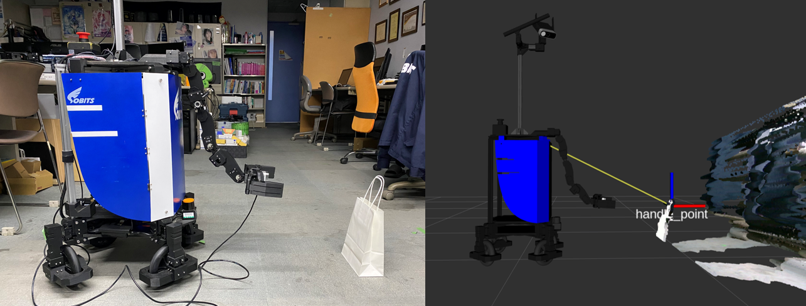

 <a name="readme-top"></a>

[JA](README.md) | [EN](README.en.md)

[![Contributors][contributors-shield]][contributors-url]
[![Forks][forks-shield]][forks-url]
[![Stargazers][stars-shield]][stars-url]
[![Issues][issues-shield]][issues-url]
[![License][license-shield]][license-url]

# bag handle estimator

<!-- TABLE OF CONTENTS -->
<details>
  <summary>Table of Contents</summary>
  <ol>
    <li>
      <a href="#Estimate the handle of a paper bag">Estimate the handle of a paper bag</a>
    </li>
    <li>
      <a href="#getting-started">Getting Started</a>
      <ul>
        <li><a href="#prerequisites">Prerequisites</a></li>
        <li><a href="#installation">Installation</a></li>
      </ul>
    </li>
    <li>
    　<a href="#launch-and-usage">Launch and Usage</a>
    </li>
  </ol>
</details>


<!-- INTRODUCTION -->
## Estimate the handle of a paper bag

<p align="right">(<a href="#readme-top">back to top</a>)</p>



The center of the handle of a paper bag is output as a "handle_point".
Once detected, the TF of the location is always output.

The start and stop of detection can be controlled by a service of type bool in execute_ctrl.


<!-- GETTING STARTED -->
## Getting Started

This section describes how to set up this repository.

### Prerequisites

First, please set up the following environment before proceeding to the next installation stage.

| System  | Version |
| ------------- | ------------- |
| Ubuntu | 20.04 (Focal Fossa) |
| ROS | Noetic Ninjemys |
| Python | 3.8 |

> [!NOTE]
> If you need to install `Ubuntu` or `ROS`, please check our [SOBITS Manual](https://github.com/TeamSOBITS/sobits_manual#%E9%96%8B%E7%99%BA%E7%92%B0%E5%A2%83%E3%81%AB%E3%81%A4%E3%81%84%E3%81%A6).

<p align="right">(<a href="#readme-top">back to top</a>)</p>


### Installation

1. Go to the `src` folder of ROS.
   ```sh
   $ roscd
   # Or just use "cd ~/catkin_ws/" and change directory.
   $ cd src/
   ```
2. Clone this repository.
   ```sh
   $ git clone https://github.com/TeamSOBITS/bag_handle_estimator
   ```
3. Navigate into the repository.
   ```sh
   $ cd bag_handle_estimator/
   ```
4. Compile the package.
   ```sh
   $ roscd
   # Or just use "cd ~/catkin_ws/" and change directory.
   $ catkin_make
   ```

<p align="right">(<a href="#readme-top">back to top</a>)</p>


<!-- LAUNCH AND USAGE EXAMPLES -->
## Launch and Usage
※Please clone [realsense_ros](https://github.com/TeamSOBITS/realsense_ros) and run install.sh first.


1. Set the parameters inside [handle_estimator.launch](launch/handle_estimator.launch)．
   ```xml
    <!-- Whether to run at startup -->
    <param name="execute_default" type="bool" value="true"/>
    <!-- Whether to output a point cloud or not -->
	<param name="pub_plane_cloud" type="bool" value="true"/>
    ...
   ```


2. Activate the RGB-D camera
   ```sh
   $ roslaunch realsense2_camera rs_rgbd.launch
   ```


2. Execute the launch file[handle_estimator.launch](launch/handle_estimator.launch)
   ```sh
   $ roslaunch bag_handle_estimator handle_estimator.launch
   ```

<p align="right">(<a href="#readme-top">back to top</a>)</p>

### Toggle detection execution
```bash
/bag_handle_estimator/run_ctr [std_msgs/Bool]
#Send True to start detection,Send False to end detection(default:True)
```

### Publications:
 * /bag_handle_estimater/cloud_plane [sensor_msgs/PointCloud2]
 * /rosout [rosgraph_msgs/Log]
 * /tf2 [tf2_msgs/TFMessage]


<p align="right">(<a href="#readme-top">back to top</a>)</p>


<!-- MARKDOWN LINKS & IMAGES -->
<!-- https://www.markdownguide.org/basic-syntax/#reference-style-links -->
[contributors-shield]: https://img.shields.io/github/contributors/TeamSOBITS/bag_handle_estimator.svg?style=for-the-badge
[contributors-url]: https://github.com/TeamSOBITS/bag_handle_estimator/graphs/contributors
[forks-shield]: https://img.shields.io/github/forks/TeamSOBITS/bag_handle_estimator.svg?style=for-the-badge
[forks-url]: https://github.com/TeamSOBITS/bag_handle_estimator/network/members
[stars-shield]: https://img.shields.io/github/stars/TeamSOBITS/bag_handle_estimator.svg?style=for-the-badge
[stars-url]: https://github.com/TeamSOBITS/bag_handle_estimator/stargazers
[issues-shield]: https://img.shields.io/github/issues/TeamSOBITS/bag_handle_estimator.svg?style=for-the-badge
[issues-url]: https://github.com/TeamSOBITS/bag_handle_estimator/issues
[license-shield]: https://img.shields.io/github/license/TeamSOBITS/bag_handle_estimator.svg?style=for-the-badge
[license-url]: LICENSE
