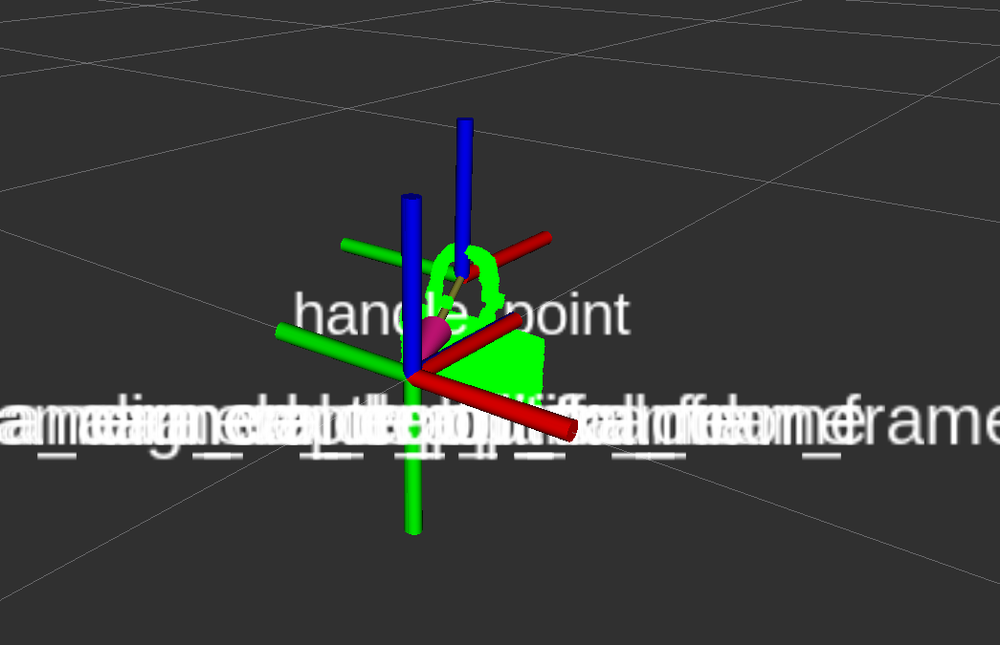

# bag_handle_estimator

## 紙袋の取っ手を推定するパッケージ



## パッケージに関する情報

紙袋の取っ手の中心を”handle_point”のTFで出力．
一度検出した場所のTFを常に出し続けます．

後述するexecute_ctrlのフラグに関わらず，ノードが生存する間はTFを出し続けます．

検出の開始，停止はexecute_ctrlのbool型のServiceで制御できます．

## How To Use
※先に[realsense_ros](https://github.com/TeamSOBITS/realsense_ros)をcloneしてinstall.shを実行しておいてください．
### 実行
```bash
$ roslaunch realsense2_camera rs_rgbd.launch
$ roslaunch bag_handle_estimator handle_estimator.launch
```
### 検出の実行を切り替えるService型
```bash
/bag_handle_estimater/execute_ctrl [std_msgs/Bool]
#Trueを送って検出開始 Falseを送って検出終了(defaultはTrue)
```

### Publications:
 * /bag_handle_estimater/cloud_plane [sensor_msgs/PointCloud2]
 * /rosout [rosgraph_msgs/Log]
 * /tf [tf2_msgs/TFMessage]

### Subscriptions:
 * /camera/depth_registered/points [sensor_msgs/PointCloud2]
 * /bag_handle_estimater/execute_ctrl  [std_msgs/Bool]
 * /tf [tf2_msgs/TFMessage]